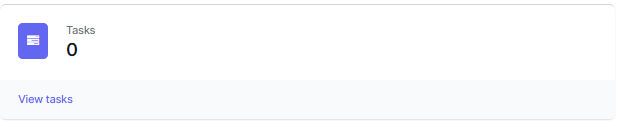

# Opening the task Pane

From the Dashboard, click **Tasks** or chose **Tasks** from the top Menu bar.

The Task Queue will be displayed.

The left hand column contains the tasks the user has chosen and is working on.

The Right hand column contains tasks which are available to work on. 

You can filter the list of tasks by entering text in the search button.

