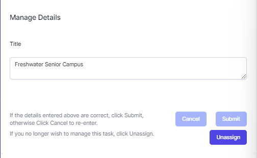
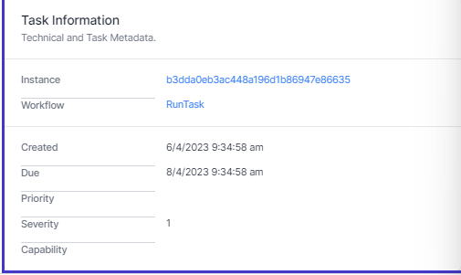

# Working with a Task

When working with a task, click the task.

You can read the instructions, complete data, unassign the task or complete the task with one or more answers.

## Header

The Task header shows the Task Title and the Task Id. The Task Id is a number.

## Description

Below the task header is the task description. This is formatted text which can include links, images, tables and more. This is created by the workflow developer and contains instructions for you to complete the task. Every task can be different, so always read the instructions!

## Details

Directly below the description is a set of data for you to edit or complete. This is created by the workflow developer and can be anything from a simple text field to a complex form. Every task can be different, so always read the instructions!

- If you change the data, you must click **Submit** to save it.
- If you make a mistake, click **Cancel**.
- If you no longer want to work with this task, click **Unassign** to remove it from your queue.

## Task Choices

Below this are the task choices. These are choices on how you wish to complete this task. These are chosen by the task developer. When you click one of these buttons, the task will dissapear and the process will continue.

## Task Information

Finally you can see information on this task.