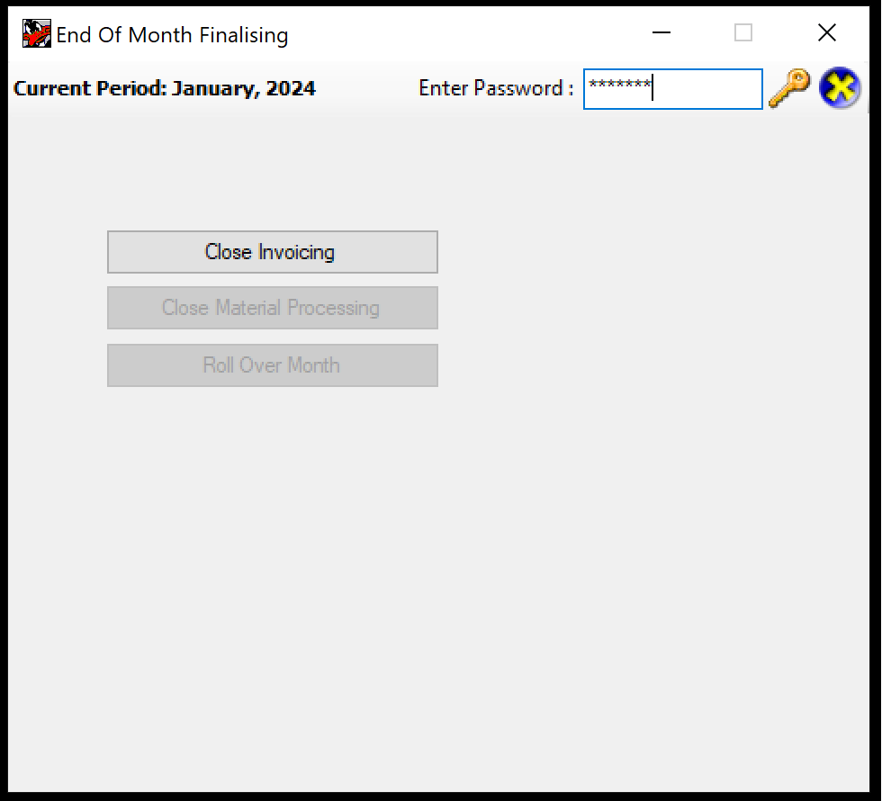
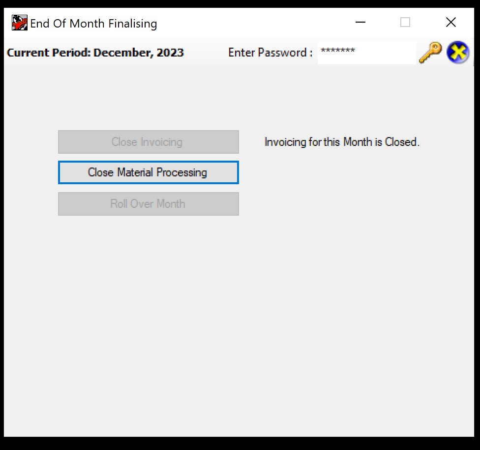
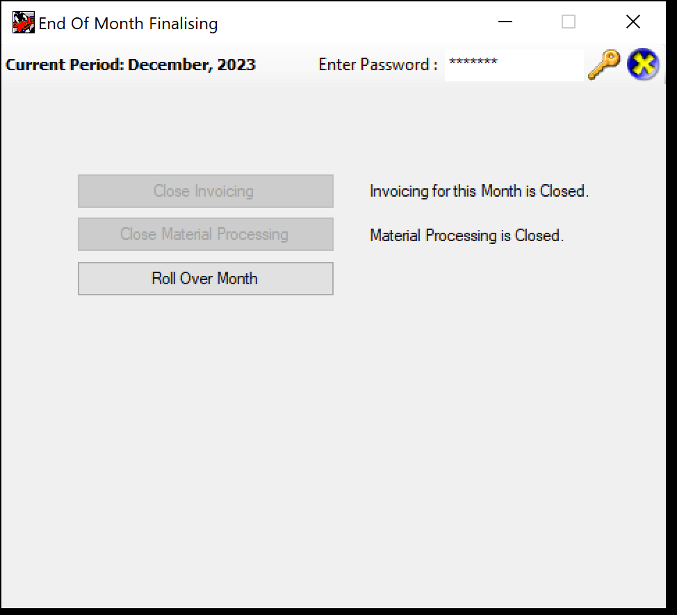
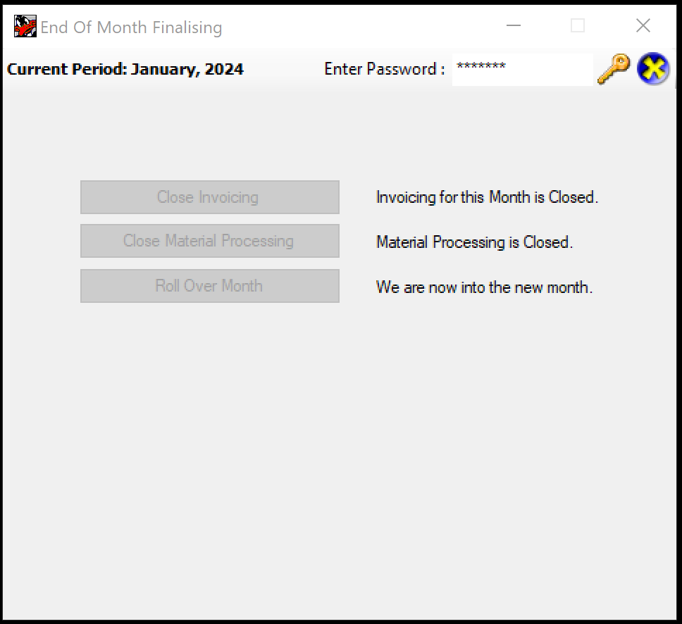

# Tuftmaster End of Month Process

The end of month process is initiated by Suzie as follows:

## 1. Step 1, Close Invoicing


1. Navigate to Tuftware2 using RDP
2. Double Click **EndOfMonth** Tool
3. Type Password: ```tufteom```
4. Click the Key Icon
   
5. Click **Close Invoicing**
    > **Note** This can take up to 40 minutes

## 2. Step 2, Rollover

1. Navigate to Tuftware2 using RDP
2. Double Click **EndOfMonth** Tool
3. Type Password: ```tufteom```
4. Click the Key Icon
   
5. Click **Close Material processing**
6. When the app has finished that process, click
   
    **Roll Over Month**
7. A Dialog saying "You have selected to Roll Over the Current Nonth. Are you SURE you want to continue? appears. Click **Yes**



**End of Month Complete**


