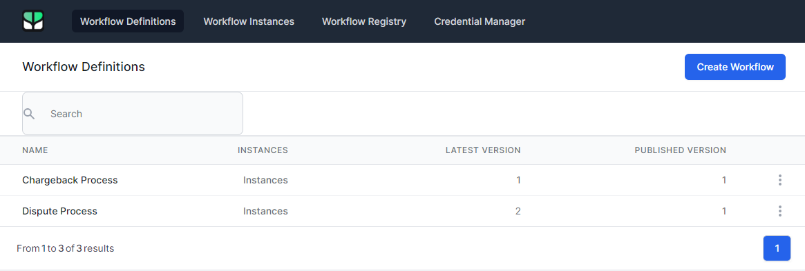
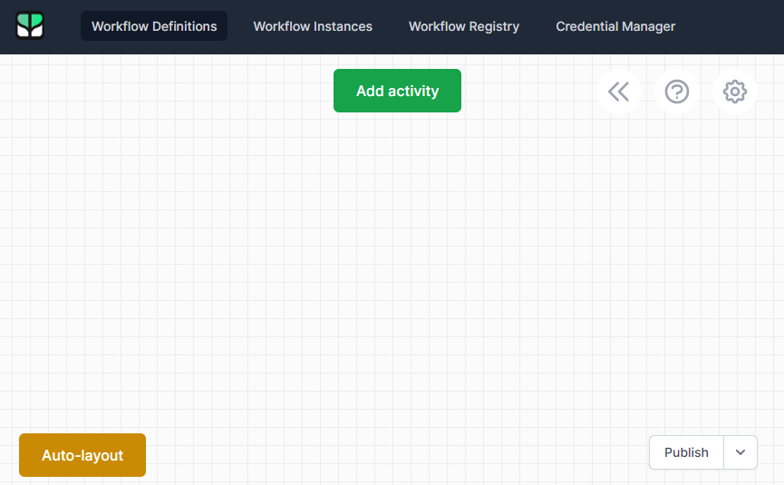
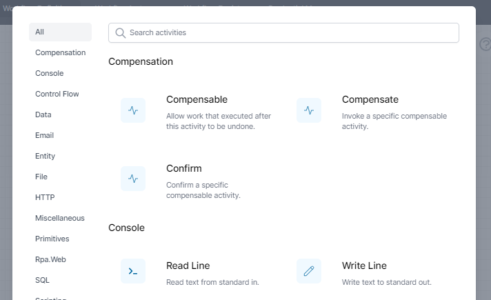
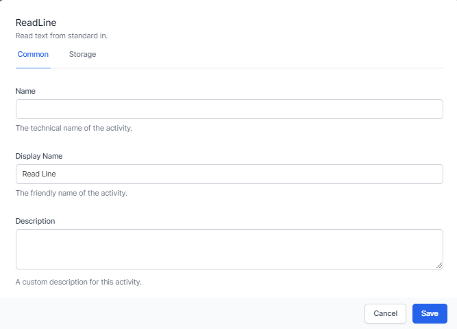
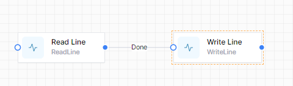

# Building Workflows

Workflows, a core feature of World of Workflows, provides a powerful and intuitive platform for designing, managing, and automating your business processes. This chapter will guide you through the process of building workflows using the Workflows Editor, adding and configuring activities, and implementing triggers to automate processes.

- **Workflow Definitions** are the description of what a workflow will do.

- **Workflow Instances** are unique instances of workflow definitions that are currently running or have finished running.

- **Activities** are individual steps within a workflow.

## Overview of Workflows

Workflows allows you to:

- Create visual, drag-and-drop workflows to model your business processes.

- Choose from over 100 activities to perform various tasks and operations.

- Configure activity settings and properties to customize workflow behaviour.

- Connect activities using transitions to define the flow of your processes.

- Implement triggers to automate workflows based on events or schedules.

## Using the Workflows Editor

To create a new workflow using the Workflows Editor, follow these steps:

1.  Navigate to **Admin -\> Workflows** in World of Workflows.  
    

2.  Click on the **Create Workflow** button.

3.  The Workflows Editor opens.  
    

The Workflows Editor provides a visual, drag-and-drop interface for designing your workflows. You can add activities from the toolbox, connect them using transitions, and configure their properties to customize their behaviour.

## Adding and configuring activities

To add an activity to your workflow, follow these steps:

1.  Click **Add activity**. You can search for activities by name or browse through categories.  
    

2.  Click on the activity and drag it onto the canvas.

3.  To configure the activity, right click the activity and choose *Edit*. Here, you can set various options, such as input and output variables, settings, and conditions.  
    

## Connecting activities

Connectors define the flow of your workflow by connecting one activity to another. To create a transition, follow these steps:

1.  Click on the *Connect* icon (a filled circle) at the edge of the source activity.

2.  Drag the connection line to the input of the target activity (an empty circle) and release.

## Implementing triggers

Triggers allow you to automate the execution of your workflows based on events, schedules, or other conditions. To add a trigger to your workflow, follow these steps:

1.  In the Workflows Editor, click on the *Activities* button.

2.  Find an activity that is colored red (this is a trigger).

3.  Select the trigger type (e.g., timer, HTTP Endpoint, Object Instance Trigger, etc.) and configure the settings specific to that trigger type, such as the interval for a timer or the URL for a HTTP Endpoint.

4.  Save your trigger.

Once you have designed your workflow, configured activities, and set up triggers, you can save and publish your workflow by clicking the **Publish** button in the Workflows Editor. Published workflows can be executed automatically based on their triggers.