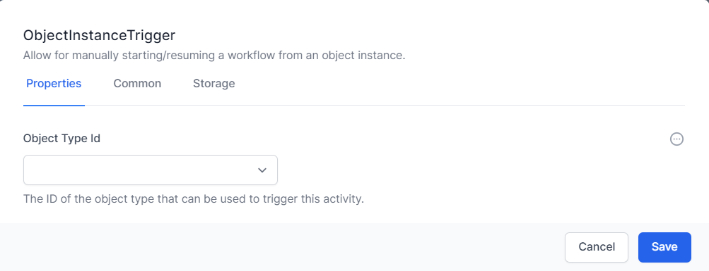
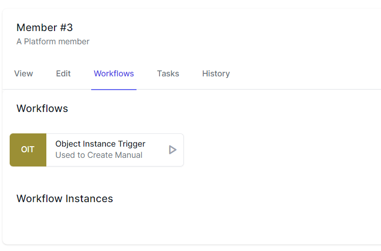
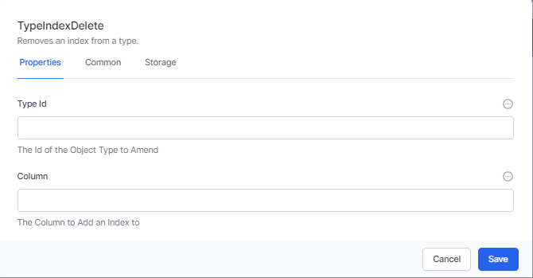
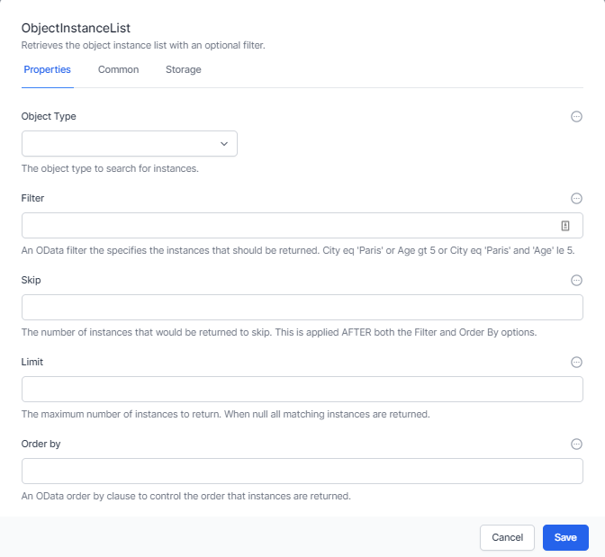
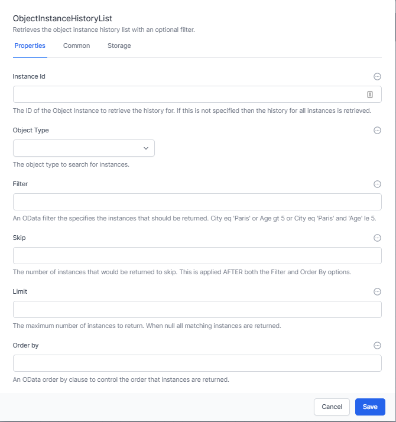

# Data Activities

*Data Activities* in Elsa Workflows provide a powerful way to interact with the *User Configurable Database* within World of Workflows.

This chapter will cover the essential Data Activities, including **Data Types Read, Create Object Instance, Update Object Instance, Get Object Instance, List Object Instances, List Object Instance History, Column Create, Type Index Create, Type Create, Type Delete, Columns Read by Type, Types Read, Type Index Delete, JSON Data Insert,** and **Object Instance Trigger**

## Triggers

### Object Instance Trigger

The Object Instance Trigger is designed to start or resume a workflow based on your interaction with a certain *Type* in the interface.

The Object Instance Trigger allows you to choose the Type you would like to initiate the workflow. It returns two variables:

1.  The InstanceId of the Instance that triggered or resumed this workflow

2.  The Instance itself as a well formed JSON Object

*To access these variables, ensure you give this activity a name (in the Common tab)*

Once you have created a workflow with an Object Instance Trigger, it appears in the Object Editor under the Workflows tab.

## Database Structure

As discussed in Database, the user interface in World of Workflow allows you to set up your database structure. For many situations, this will be all you need to do. If you need to manipulate the database structure and create and modify tables, columns and indexes within a workflow there are several activities you can use

1.  Type Create

2.  Type Delete

3.  Types Read

4.  Type Index Create

5.  Type Index Delete

6.  Column Create

7.  Columns Read by Type

### Type Create

Type Create creates a new table or type in the database.

It allows you to enter:

- **Type Name –** the name of the type or table

- **Type Description –** the description of the type

It will create a new type with a single string column called “Title”.

It will return the TypeId of the new Type in the activity property of ReturnId.

### Type Delete

Type delete will delete a type given its Id.

### Types Read

Types Read takes no input parameters and returns a JSON object of all the types in your system

### Type Index Create

Indexes are used by databases to lookup information quickly. They keep an index of all the available data in a column and can use it to find information faster than working through each record. Where you will use a column to find data, it is important to establish an index for that column.

Enter the Type Id and Column Name to create an index for that Column. The activity will return the Id of the column as return Id.

###  Type Index Delete

Use this activity to delete an index you created previously.

### Column Create

Column Create adds a new Column to a Type.

This activity creates a new column for a Type (or Table). Enter the following information:

- **Type –** Choose the type (or table) to add a column for

- **Column Name –** Choose a name for the column. Best practices dictate a single word with no spaces or non text characters.

- **Column Display Name –** Enter the name that will be shown to the end-user in the system for this column.

- **Column Description –** Enter the description of the column so you can understand later what the column is for.

- **Column Type Id –** This is the type of data the column contains. Valid entries are:

  - **Big Integer –** This can be a very large number but is commonly used as a relationship between this and an object in another type. If you wish this to be a relationship, complete the *The Type Id of any relationship* below.

  - **Integer –** This is a whole number, positive or negative, without decimal places.

  - **Decimal 2 –** This is a decimal number with two decimal places, e.g. a currency.

  - **Decimal 5 –** This is a decimal number with five decimal places. It is commonly used for percentages and other numbers that require great precision.

  - **True/False –** This stores the value of true or false

  - **String –** This stores string information, such as text

  - **DateTime –** This is a date/time data stored as UTC and displayed as local time.

  - **Url –** This is a hyperlink or URL.

  - **Embed –** This embeds multimedia such as video

- **The Type Id of any relationship –** This is the type you want this column to lookup. If so, the **Column Type Id** must be a **Big Integer**

- **Display Order –** The order this column appears in the User Interface

- **Visible –** Whether the column is visible to the end user

- **Indexed –** Whether the column is indexed.

If successful, this activity returns the ColumnId of the newly created column.

### Columns Read by Type

This returns all the columns for the selected type. You can choose to return all columns or just visible columns.

The array of columns is returned in the Columns property of this activity.

## Data

Once the data structure is in place, you can work with the data itself. The following activities allow you to manipulate data:

- Create Object Instance

- Update Object Instance

- Get Object Instance

- List Object Instances

- List Object Instance History

- JSON Data Insert

### Create Object Instance

This activity allows you to create a new object instance and data (sometimes referred to as a row), and to save this new object into a variable.

First, select the **Object Type.** Then add any data for the **Columns** for this Type into the **Values** area. Finally enter a **Variable Name** to create a workflow variable containing this new object instance.

This activity also returns **Instance,** which is the new instance created and **InstanceId** which is the Id of the new Instance (or row).

## Update Object Instance

This activity allows you to update the data in an instance and optionally clear any fields that are not provided.

First enterthe **Instance Id of the instance you wantg to update. This might have been returned when you used a** *Create Object Instance* **activity** Next you can choose to **Clear Omitted fields.** That means if this type has a column and you *do **not** include data for it**,** the data will be cleared.*

You can enter columns and values or present this as JavaScript or a JSON file.

Finally, you can choose a **Variable Name** to have the updated instance (or row) stored in a workflow variable.

The activity will have a property on exit called **Instance** which also contains the updated instance (or row).

### Get Object Instance

This activity simply retrieves the current information on an instance (or row) and puts it into a variable.

The activity will have a property on exit called **Instance** which also contains the instance (or row).

### List Object Instances

This activity retrieves a list of object instances and accepts OData Filters and queries.

See oData Query Syntax for information on constructing OData queries

The activity accepts the following inputs:

1.  The **Object Type** you wish to get a list for

2.  The **Filter** which is an OData filter to filter the records.

3.  **Skip-** Once the filter and order by has been performed this selects the record to start from. This is commonly used to retrieve pages of data of a certain size. The value used in *Skip* would normally be a variable that is incremented in a loop.

4.  **Limit** – this limits the number of rows to return and is commonly used in conjunction with **Skip** to select a specific page of data.

5.  **Order By –** This selects the order in which rows are returned and sorts the data as required.

The activity has a single output property **Output** which includes the requested list. Ensure you give the activity a name under the **Common** tab to ensure you can access this information.

### List Object Instance History

Every time you update an instance (or row), the system saves the previous row as history. This can be retrieved using the List Object Instance History activity.

This accepts OData filters and queries.

See oData Query Syntax for information on constructing OData queries

The activity accepts the following inputs:

1.  The **Instance Id** for which you wish to get a history list

2.  The **Filter** which is an OData filter to filter the records.

3.  **Skip-** Once the filter and order by has been performed this selects the record to start from. This is commonly used to retrieve pages of data of a certain size.

4.  **Limit** – this limits the number of rows to return and is commonly used in conjunction with **Skip** to select a specific page of data.

5.  **Order By –** This selects the order in which rows are returned and sorts the data as required.

The activity has a single output property **Output** which includes the requested list. Ensure you give the activity a name under the **Common** tab to ensure you can access this information.

### JSON Data Insert

*JSON Data Insert* is an activity designed to use JSON data to perform the following:

1.  Locate an instance with a matching key field and update the instance (if no match then create a new instance)

2.  If a column doesn’t exist, create it

3.  Add the data to an instance

First, select the *Object Type*

Next, select a key field. This is used to identify if this is a new instance or udpate an existing one. If you are using something like JotForm, make this the submission_id.

Finally decide whether to clear omitted fields or not and insert the data, either as JSON or as Name Value entries.

The activity has a single output property **Output** which includes the added or updated instance (or row). Ensure you give the activity a name under the **Common** tab so you can access this information.

