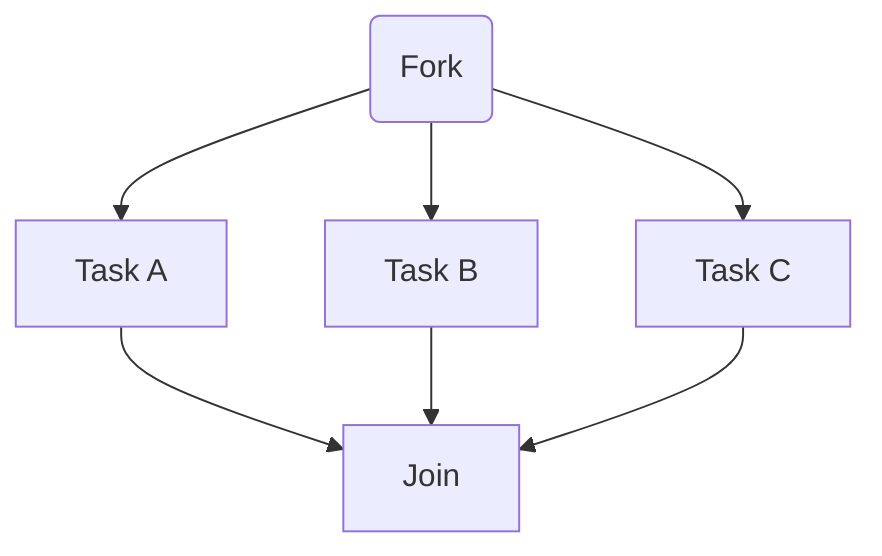
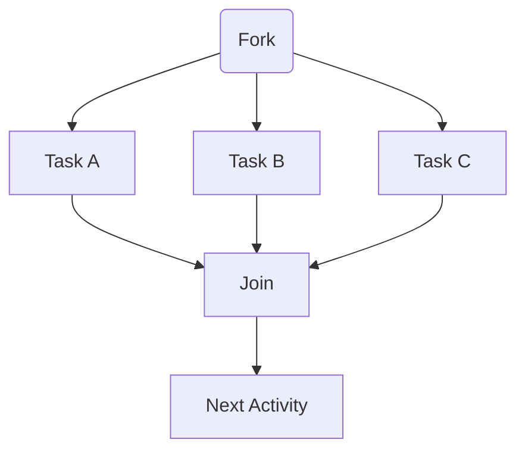
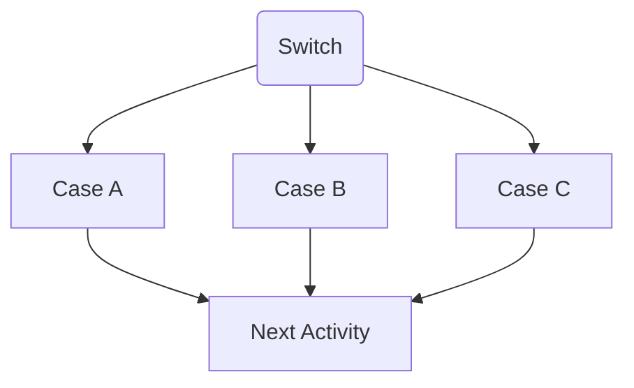

## Activity List

The following section is a comprehensive list of activities available in the platform, noting that you can extend the platform using plugins.

### Compensation

Compensable activities in Elsa Workflows refer to actions that can be compensated or "undone" if certain conditions are not met or if an error occurs during the execution of a workflow. Compensable activities are essential for ensuring the integrity and reliability of the workflow processes, particularly in scenarios where multiple steps are involved, and the correct execution of each step is crucial for the overall success of the process.

Compensable activities have the following characteristics:

- **Reversibility**: A compensable activity has a corresponding "undo" operation that can be executed to reverse its effects and return the system to its previous state before the activity was executed. This is useful for handling errors and maintaining data consistency.

- **Idempotency**: Compensable activities are designed to be idempotent, meaning they can be executed multiple times without causing any side effects or changing the outcome. This ensures that compensating actions will not introduce new errors or inconsistencies in the system.

- **Transactional nature**: Compensable activities are often used in conjunction with transactions to ensure that a series of related actions are either all completed successfully or none of them are. If any activity in the transaction fails, the compensating actions are executed to reverse the completed activities, maintaining the system's consistency

- **Error handling**: Compensable activities allow for robust error handling, as they can be used to automatically roll back a workflow to a previous state if an error occurs. This helps to minimize the risk of data corruption or other issues that may arise from failed operations.

In Workflows, compensable activities would be designed and implemented as part of the overall workflow, with each activity having a clearly defined compensating action. This ensures that any errors or inconsistencies can be effectively addressed, maintaining the system's stability and reliability.

The following are the activities available for compensation:

#### Compensable

Allows work that is executed after this activity to be undone.

#### Compensate

Invokes a specific compensable activity.

#### Confirm

Confirms a specific compensable activity.

### Console Activities

In Elsa Workflows, Console Activities are used for simple input and output operations to interact with the user through the console. They are helpful for gathering data, providing status updates, or displaying results. There are two main Console Activities in Elsa Workflows: Read Line and Write Line.

#### Read Line

The Read Line Activity is used to read a line of text input from the user through the console. This activity allows you to gather data or responses from the user during the execution of a workflow.

1.  Add the Read Line Activity to your workflow where you want to capture user input.

2.  Optionally, you can provide a custom prompt by setting the 'Prompt' property. This text will be displayed to the user before they enter their input.

3.  After the activity is executed, the user's input will be stored in the specified output variable (e.g., 'UserInput').

You can then use the captured input in subsequent activities or for decision-making within the workflow.

**Note:** Although Read Line is available, it will not work as World of Workflows runs as a service and cannot interact with the console.

#### Write Line

The Write Line Activity is used to display a line of text to the user through the console. This activity is useful for providing status updates, displaying results, or giving instructions to the user during the workflow execution.

1.  Add the Write Line Activity to your workflow where you want to display text to the user.

2.  Set the 'Text' property to the message you want to display. You can use static text or include variables and expressions to display dynamic content.

3.  When the activity is executed, the specified text will be displayed on the console.

You can use the Write Line Activity multiple times throughout your workflow to provide updates or information to the user as needed.

By incorporating these Console Activities into your Elsa Workflows, you can create more interactive and user-friendly processes that allow for better communication between the system and the end user.

**Note:** Although Write Line is available, it will not usefully work as World of Workflows runs as a service and cannot interact with the console.

### Control Flow

In Elsa Workflows, control flow activities are used to manage the execution order of activities within a workflow and to implement conditional logic or looping constructs. They help to create dynamic and flexible processes based on the specific requirements of your use case. Some common control flow activities in Elsa Workflows include:

#### If-Else

The *If-Else* Activity allows you to define conditional branches in your workflow, executing different sets of activities based on a specified condition.

1.  Add the *If-Else* Activity to your workflow where you want to introduce conditional logic.

2.  Set the **Condition** property to an expression that evaluates to either true or false.

3.  Connect the **True** outcome to the activities that should be executed if the condition is true.

4.  Connect the **False** outcome to the activities that should be executed if the condition is false.

#### While

The *While* Activity is used to create loops in your workflow, repeatedly executing a set of activities as long as a specified condition is true.

1.  Add the *While* Activity to your workflow where you want to create a loop.

2.  Set the **Condition** property to an expression that evaluates to either true or false.

    1.  Connect the **Loop** outcome to the activities that should be executed within the loop. Use the **CurrentItem** property within the iteration activities to access the current item in the collection.

    2.  Note that these activities may be executed many times. The last of these activities will normally have no outcome.

3.  Connect the **Done** outcome to the activities that should be executed after the loop has finished.

#### ForEach

The *ForEach* Activity iterates over a collection of items, executing a set of activities for each item in the collection.

1.  Add the *ForEach* Activity to your workflow where you want to iterate over a collection.

2.  Set the **Collection** property to a collection or an expression that evaluates to a collection.

3.  Connect the **Iteration** outcome to the activities that should be executed for each item in the collection.

    1.  Use the **CurrentItem** property within the iteration activities to access the current item in the collection.

    2.  Note that these activities may be executed many times. The last of these activities will normally have no outcome.

4.  Connect the **Done** outcome to the activities that should be executed after the iteration has completed.

#### Switch

The *Switch* Activity is used to create multiple branches in your workflow based on the value of a specified expression.

1.  Add the *Switch* Activity to your workflow where you want to create multiple branches.

2.  Set the **Expression** property to an expression that evaluates to a value used for branching.

3.  Add one or more **Case** outcomes, each with a value that corresponds to a possible result of the *expression*.

4.  Connect each **Case** outcome to the activities that should be executed for that specific value.

5.  Optionally, you can add a **Default** outcome, which will be executed if none of the case values match the expression result.

#### Break

The *Break* Activity in Elsa Workflows is a control flow activity used to exit a loop prematurely. It allows you to terminate the execution of activities within a loop when a specified condition is met, instead of waiting for the loop's original exit condition. The Break Activity is particularly useful when working with While and ForEach activities, providing a way to break out of the loop based on custom criteria.

1.  Add the *Break* Activity to your workflow within a loop (created using a *While* or *ForEach* activity).

2.  Set a condition or trigger for the *Break* Activity. This can be done using an If-Else Activity, or by incorporating a condition directly into the Break Activity.

3.  When the *Break* Activity is executed, the workflow will exit the current loop immediately, skipping the remaining activities in the loop and moving on to the next activity connected to the loop's **Done** outcome.

For example, if you are using a *While* Activity to process a list of items and you want to stop processing when a specific item is encountered, you could use an *If-Else* Activity within the loop to check for that item. If the item is found, the I*f-Else* Activity would execute the *Break* Activity, immediately stopping the loop and moving on to the next activity outside the loop.

The *Break* Activity helps to improve the efficiency and flexibility of workflows, allowing you to create more dynamic and responsive processes that can adapt to different conditions during runtime.

#### For

The *For* Activity is a control flow activity in Elsa Workflows that allows you to create loops with a predefined number of iterations. This activity is useful for executing a set of activities a specific number of times, providing a more controlled and predictable looping construct compared to the While Activity.

1.  Add the *For* Activity to your workflow where you want to create a loop with a fixed number of iterations.

2.  Set the **Start** property to the initial value of the loop counter (usually 0 or 1, depending on your requirements).

3.  Set the **End** property to the value at which the loop counter should stop (exclusive). The loop will iterate as long as the loop counter is less than the **End'**value.

4.  Optionally, set the **Step** property to define the increment value for each iteration. By default, the 'Step' value is typically 1, meaning the loop counter will increment by 1 after each iteration.

5.  Connect the **Iteration** outcome to the activities that should be executed within the loop.

6.  Connect the **Done** outcome to the activities that should be executed after the loop has finished.

Use the **CurrentIndex** property within the loop activities to access the current value of the loop counter.

Here's an example of how the *For* Activity might be used in a workflow:

- Start value: 0

- End value: 5

- Step value: 1

In this example, the loop would execute the activities connected to the **Iteration** outcome five times (with loop counter values of 0, 1, 2, 3, and 4). Once the loop counter reaches 5, the loop will exit, and the activities connected to the **Done** outcome will be executed.

The *For* Activity provides a structured and straightforward way to create loops in Elsa Workflows, enabling you to implement repetitive tasks with a predictable number of iterations.

#### Fork

The *Fork* Activity in Elsa Workflows is a control flow activity that allows you to create parallel branches of execution within your workflow. It enables you to split the workflow into multiple paths that can be executed concurrently, improving the efficiency and performance of your processes by allowing tasks to be completed simultaneously.

1.  Add the *Fork* Activity to your workflow where you want to create parallel branches of execution.

2.  Create the **branches** by using meaningful names, so that your workflow is easy to read

3.  Connect the *Fork* Activity to multiple subsequent activities, *each* representing a separate branch of execution. Each connection from the Fork Activity represents a new parallel path.

4.  We do not require a Join activity to wait for all branches in World of Workflows. The Join Activity would usually wait for all the parallel branches to complete before continuing with the subsequent activities in the workflow.

For example, imagine you have a workflow where you need to perform three separate tasks (Task A, Task B, and Task C) that can be executed independently and concurrently. You could use the Fork Activity to create three parallel branches, one for each task, improving the overall performance of the workflow by completing the tasks simultaneously.

Here's a simplified representation of the workflow:

The Fork Activity is a powerful tool for optimizing your workflows, allowing you to take advantage of parallel processing and improving the overall performance and efficiency of your processes.

#### Join

The *Join* Activity in Elsa Workflows is a control flow activity used to synchronize multiple parallel branches of execution back into a single path. It is typically used in conjunction with the Fork Activity, which creates parallel branches in the workflow for concurrent execution. The Join Activity ensures that all parallel branches have completed before the workflow proceeds to the next activity in the sequence.

1.  After using a *Fork* Activity to create parallel branches of execution, add the *Join* Activity at the point where you want to merge the parallel branches back into a single path.

2.  Connect each parallel branch to the *Join* Activity.

3.  When the *Join* Activity is reached during workflow execution, it will wait until all connected parallel branches have completed their execution.

4.  Once all parallel branches have finished, the Join Activity will allow the workflow to continue with the subsequent activities connected to it.

For example, imagine you have a workflow with three parallel tasks (Task A, Task B, and Task C) created using the Fork Activity. The Join Activity would be used to ensure that all three tasks have completed before the workflow proceeds to the next step, such as processing the combined results of the tasks.

Here's a simplified representation of the workflow:

Note: there is also the option of allowing the *Join* activity to continue when any one of the connected branches reaches the *Join* Activity.

The *Join* Activity is essential for managing parallel branches in Elsa Workflows, ensuring that all concurrent tasks are completed before the workflow moves on to subsequent activities. This enables you to maintain control and consistency in your processes, while still benefiting from the performance improvements provided by parallel execution.

#### Parallel for Each

The *Parallel ForEach* Activity in Elsa Workflows is a control flow activity that enables concurrent execution of a set of activities for each item in a collection. It is similar to the standard *ForEach* Activity, but with the added benefit of parallel processing to improve performance and efficiency. The Parallel ForEach Activity is particularly useful when working with large collections or when executing time-consuming tasks that can be processed independently.

1.  Add the *Parallel ForEach* Activity to your workflow where you want to concurrently iterate over a collection of items.

2.  Set the 'Collection' property to the collection you want to iterate over or an expression that evaluates to a collection.

3.  Connect the 'Iteration' outcome to the activities that should be executed for each item in the collection. These activities will be executed in parallel for each item, potentially improving the overall performance of the workflow.

4.  Connect the 'Done' outcome to the activities that should be executed after the parallel iteration has completed.

5.  Use the 'CurrentItem' property within the iteration activities to access the current item in the collection.

It's important to note that when using the Parallel ForEach Activity, you need to ensure that the activities within the loop can be executed concurrently without causing issues such as data corruption or race conditions. This may require additional synchronization mechanisms, such as locks or semaphores, depending on the specific activities being executed.

The Parallel ForEach Activity provides a powerful and efficient way to process collections in Elsa Workflows, enabling you to take advantage of parallel processing to improve the performance of your processes.

#### Switch

The Switch Activity in Elsa Workflows is a control flow activity that allows you to create multiple branches of execution based on the value of a specified expression. It enables you to route the workflow to different sets of activities depending on the evaluated result, making your workflow more dynamic and adaptable to various situations.

1.  Add the *Switch* Activity to your workflow where you want to create multiple branches based on a specific value or condition.

2.  Set the **Expression** property to an expression that evaluates to a value used for branching. This value will determine which branch of execution the workflow will follow.

3.  Add one or more **Case** outcomes, each with a value that corresponds to a possible result of the expression. The value of the **Case** outcome should match the expected result of the expression to create a connection to the corresponding branch of activities.

4.  Connect each **Case** outcome to the activities that should be executed for that specific value. These activities represent the different branches that the workflow can take based on the evaluation of the expression.

5.  Optionally, you can add a **Default** outcome, which will be executed if none of the case values match the expression result. This outcome acts as a catch-all for any unexpected or unhandled values.

Here's an example of how the *Switch* Activity might be used in a workflow:

- Expression: OrderStatus

Assuming that OrderStatus is a *variable* that can have the values **New**, **Processing**, or **Complete**, you would create three **Case** outcomes with these values, and connect each outcome to the respective activities that should be executed for each status:

The *Switch* Activity allows you to create more dynamic and flexible workflows that can adapt to different situations based on the evaluation of specific conditions or values. This enables you to build more efficient and responsive processes tailored to the specific needs of your use case.

## Email Activities

*Email* activities are designed to work with SMTP Email Systems. For Office 365, please see the *Send Http* activity and communicate with Microsoft graph as shown in the examples.

### Send Email

The *SendEmail* Activity in Elsa Workflows is an action activity that allows you to send an email as part of your workflow. This activity can be used to notify users or stakeholders, send reports, or provide status updates based on the events and outcomes of your workflow. The *SendEmail* Activity typically requires integration with an email service or SMTP server to handle the actual sending of the email.

1.  Add the *SendEmail* Activity to your workflow where you want to send an email.

2.  Configure the email service or SMTP server settings, if required. This step depends on the specific implementation of Elsa Workflows and might involve setting up API keys, credentials, or other configuration options to connect with the email service. This configuration should be set in the appsettings.json file in the installation folder of World of Workflows.

3.  Set the **From** property to the email address you want the email to be sent from. This is typically your own email address or an address associated with your application or organization.

4.  Set the **To** property to the recipient's email address or a list of email addresses if you want to send the email to multiple recipients.

5.  Set the **Subject** property to the subject line of the email.

6.  Set the **Body** property to the content of the email. This can be plain text or HTML, depending on the capabilities of the SendEmail Activity implementation and the email service being used.

7.  Optionally, you can configure additional properties such as **Cc**, **Bcc**, **ReplyTo**, or **Attachments**, depending on the specific implementation of the *SendEmail* Activity and your requirements.

8.  Connect the *SendEmail* Activity to other activities in your workflow as needed. You might want to use control flow activities like *If-Else* or *Switch* to determine when the email should be sent or what content it should contain.

The *SendEmail* Activity enables you to integrate email notifications and communication directly into your Elsa Workflows, allowing you to automate notifications, alerts, and updates as part of your overall process automation.

## File Activities

*File* Activities in Elsa Workflows refer to a set of activities that allow you to interact with the file system to perform various operations, such as reading, writing, creating, or deleting files and directories. These activities enable you to incorporate file management tasks into your workflows and automate processes that involve file manipulation.

Some common File Activities in Elsa Workflows include:

### Read File

The *ReadFile* Activity is used to read the contents of a file and store the data in a variable or output property for further processing in the workflow.

1.  Add the *ReadFile* Activity to your workflow where you want to read a file.

2.  Set the **FilePath** property to the path of the file you want to read.

3.  Connect the *ReadFile* Activity to other activities that will process the file's content or use it as input.

### WriteFile

The *WriteFile* Activity allows you to write data to a file, either creating a new file or overwriting an existing one.

1.  Add the *WriteFile* Activity to your workflow where you want to write data to a file.

2.  Set the **FilePath** property to the path of the file you want to write.

3.  Set the **Content** property to the data you want to write to the file.

4.  Configure the **Append** property if you want to append data to the existing file instead of overwriting it.

### DeleteFile

The *DeleteFile* Activity is used to delete a file from the file system.

1.  Add the *DeleteFile* Activity to your workflow where you want to delete a file.

2.  Set the **FilePath** property to the path of the file you want to delete.

3.  Connect the DeleteFile Activity to other activities that may depend on the deletion of the file.

These *File* Activities allow you to integrate file management tasks into your Elsa Workflows, helping you automate processes that involve file manipulation and improving the overall efficiency of your workflows.

By using these control flow activities, you can create complex and dynamic workflows that adapt to varying situations and requirements, enabling more efficient and flexible process automation.
