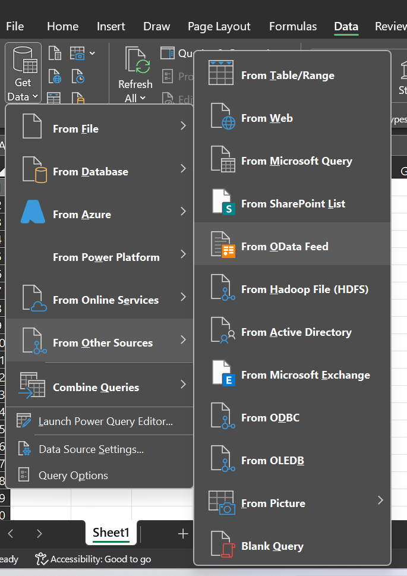
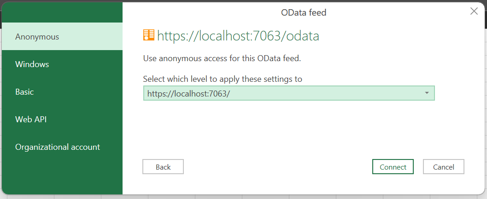
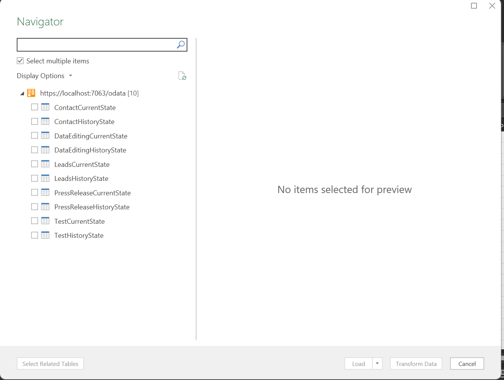

# Reporting

Reporting on World of Workflows can be performed using any oData Client. Examples of this are Excel, PowerBI or Tableau. The following instructions are for Excel:

## Excel

Open a new spreadsheet in Microsoft Excel

Click the **Data** menu

Click **Get Data**

Choose **From Other Sources** and choose **oData feed.**

In the OData feed window, enter the URL of your World of Workflows Instance followed by /odata. For example for World of Workflows PE this will be <https://localhost:7063/odata>. Once done, click Ok

Next, for World of Workflows Business Edition, choose Organizational Account and Login. For World of Workflows Personal Edition, just click **Connect**

Next, select the items you want to report on. For each type there are two tables, the **CurrentState** and the **HistoryState.** Current State is the current configuration of those objects whereas History State is the history and changes for that object.

When you have selected your tables click **Transform Data.**

You will now be working with the Power Query Editor. Please refer to Excel documentation on how to manipulate this data. When complete click **Close & Load**

