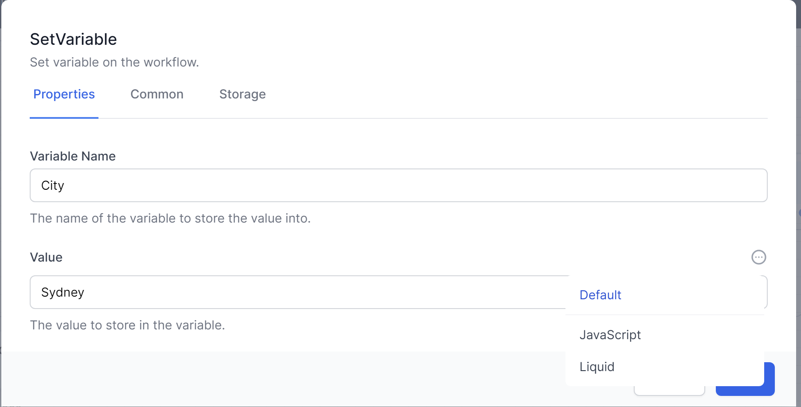
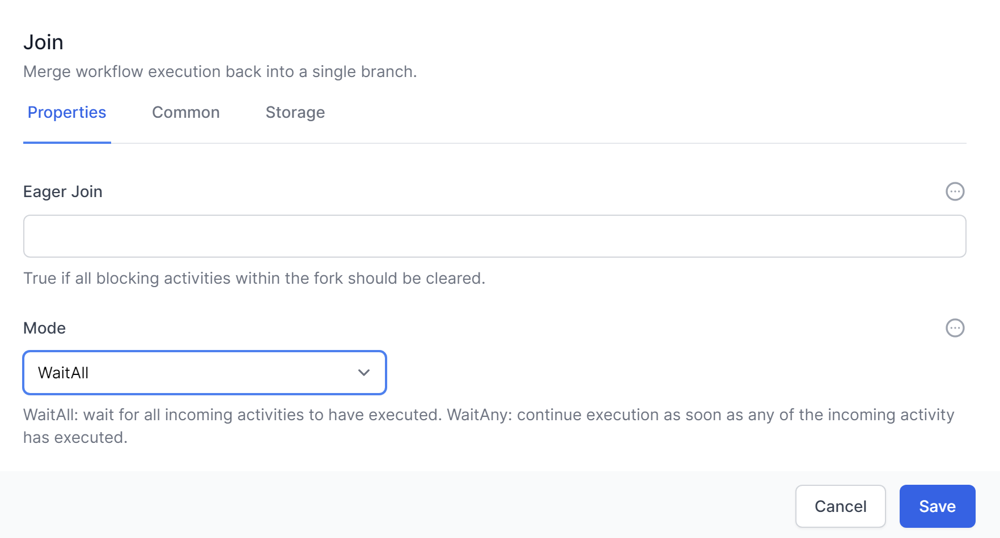
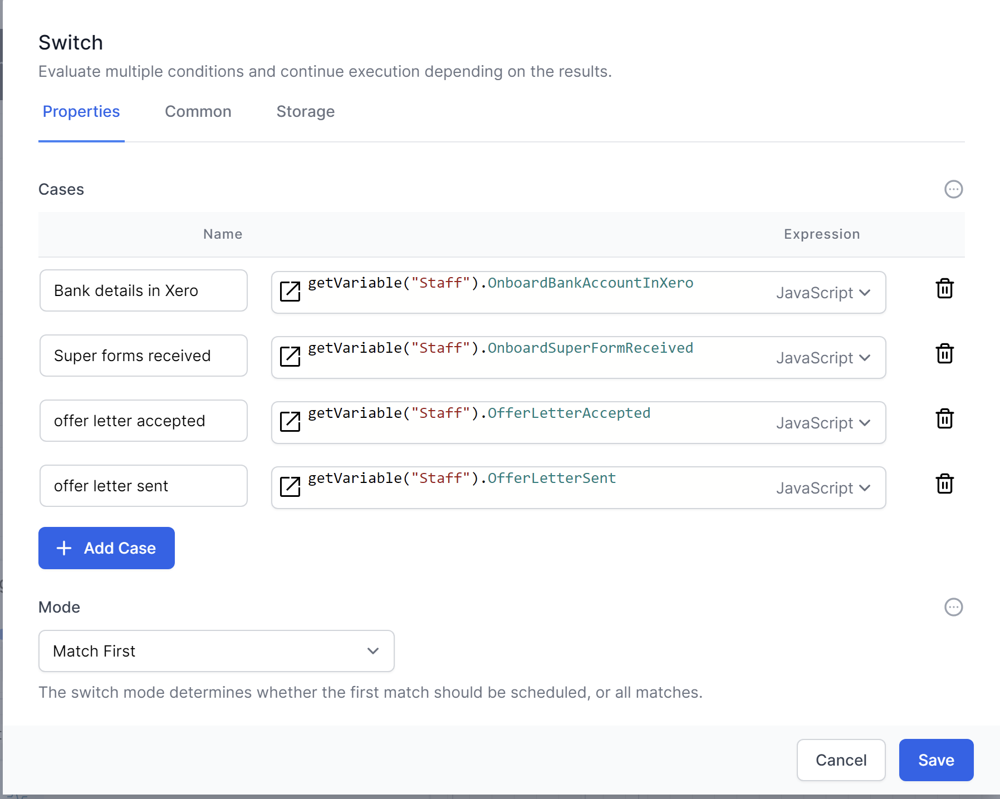
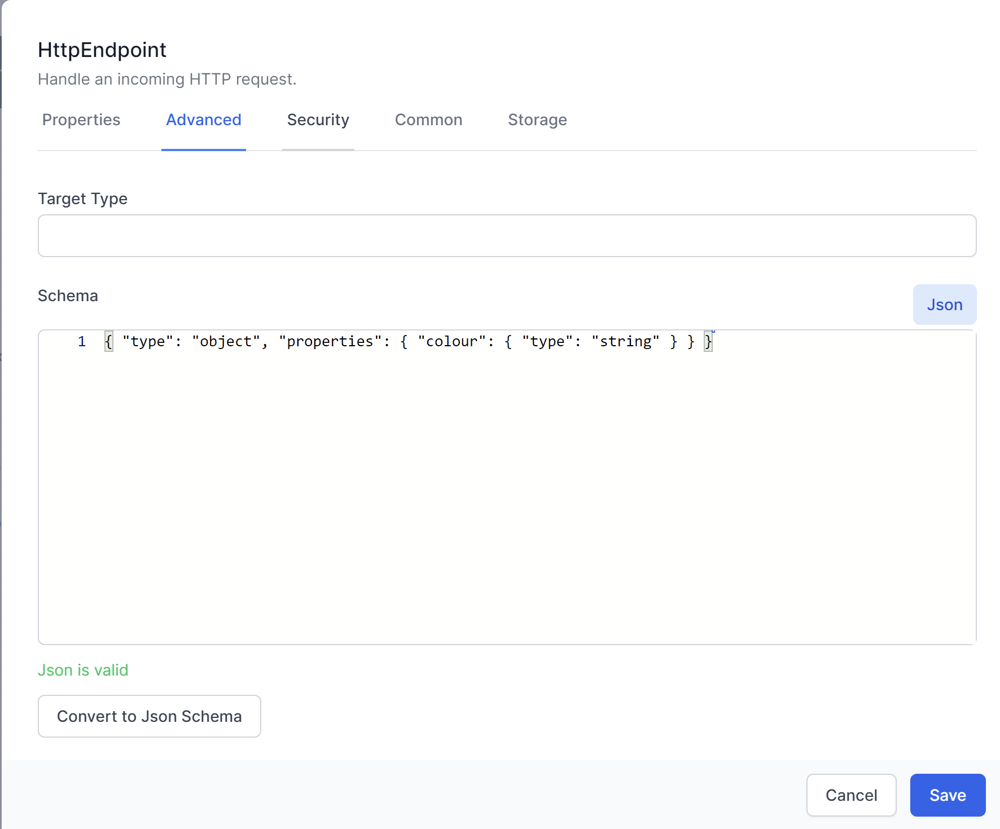
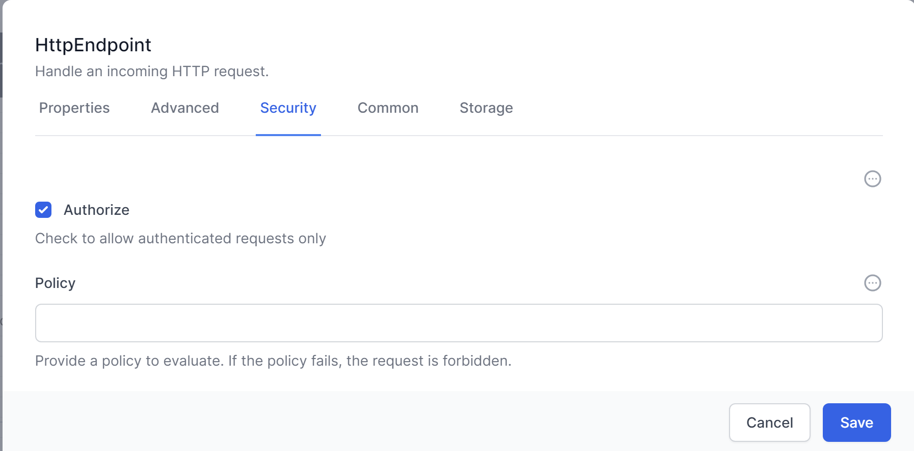
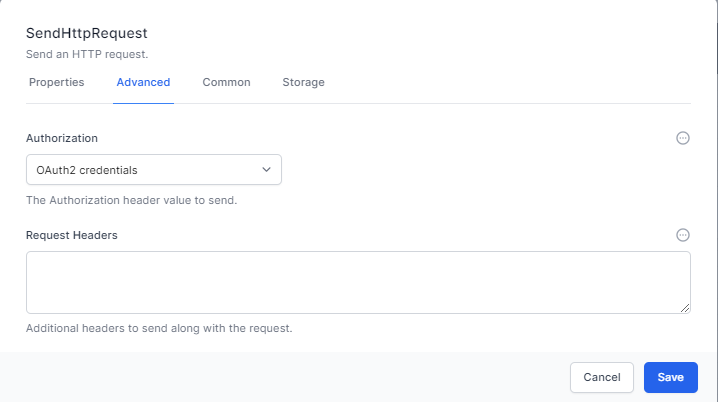

# What are Workflows?

*Workflows* are like small processes which run in the system to complete a business process. There are many of the structures one might find in programming languages. The section below is for complete novices at programming or telling computers to do things.

Computers are machines which follow our instructions exactly. Sometimes it doesn’t seem like this because modern computers are performing billions of operations every second and it is difficult to see what the instructions are.

Workflows allows you to write instructions for the computer to follow. These can include sending emails, reading data or writing and saving files. Workflows makes this simpler, by providing a simple graphical interface.

#### Common Settings

> Every *Activity* in *Workflows* allows you to set the following:

### **Common Settings**

> **Common settings** are the same for every activity. They include Name, Display Name and Description and are used as follows:

- **Name**: Use this name to refer to this activity in future activities using Liquid or JavaScript.

- **Display Name** – Use this to change how the activity is named in the designer.

- **Description** – Use this to show other workflow developers how this activity is used and what it is for.

#### Variables

> Variables are temporary places to store information. It’s common to want to store information and retrieve and work with it later. With Workflows, we can define both variables and transient variables which can store all types of data and information.
>
> Variables are created with the *Set Variable* activity. They can also be created in *JavaScript* using a *SetVariable()* command. Variables are read using a *JavaScript* command *GetVariable()* or with *Liquid* using a command such as *{{Variables.variableName}}*
>
> *Variables exist only while the workflow is running. To keep the data permanently you will need to write variable to a field in a Type.*

### Flow control

You will use the flow control features in Workflows to link your Activities in Workflows, and provide the logic required to formalise your business process.

This chapter will provide an overview of the core Flow Control activities, including *Break*, *For*, *For Each*, *Fork*, *If/Else*, *Join*, *Parallel For Each*, *Switch*, *While*, *Set Variable*, and *Set Transient Variable*.

### JavaScript and Liquid

You can enter information into the Properties of *Activities* using either the default format (ie just typing in text, numbers or dates.

For example, here is the SetVariable activity. It asks for a *Variable Name* and a Value. You would enter the variable name as normal text.

The Value can be entered as either JavaScript, Liquid or Default text. Click on the above the entry box to switch the type of input you need.

An example of setting a variable with JavaScript.

JavaScript is a powerful language which is simple to learn and provides significant extensibility to the platform.

Liquid is simpler and allows the creation of strings from other data.

### Loops

We often want computers and workflows to repeat themselves. For example we might want the same process to occur for every row of a spreadsheet or every lead in a database. For this we use loops. In workflows we have a several types of loops:

#### For

> The *For Loop* has a starting number, an ending number and a step. This loop will maintain a counter. On the first pass (iteration), the counter is set to the starting number. On the second iteration, the counter has the step value added to it. The system then compares the counter to the ending number and will only keep going if the counter is less than the ending number.
>
> The for loop is useful when we want to count through several things where we know or can easily calculate the starting number or step.
>
> *For loops can count up (Step \>0) or down (Step\<0) and the comparison can be any of less than, less than or equal to, greater than and greater then or equal to.*
>
> The *For* activity requires an initial value, an end value, and an optional step value. The loop will continue to execute the activities within it until the end value is reached or a Break activity is encountered.

> The For activity allows you to set the following:

- **Start** – This is a number which defines the start counter for the loop. This can be entered directly into the activity or calculated using Javascript or Liquid.

- **End** – This is a number which defines the end comparison for the loop. This can be entered directly into the activity or calculated using JavaScript or Liquid.

### For Each

> The *For Each* activity is designed to iterate over a collection of items, such as an array or a list. It will execute the activities within the loop for each item in the collection. The loop will continue until all items have been processed or a Break activity is encountered.
>
> Imagine we have a variable with the colors in the rainbow. We might represent it as:

\[

"Red",

"Orange",

"Yellow",

"Green",

"Blue",

"Indigo",

"Violet"

\]

> The item above is known as a **JSON array**. A *For Each loop*, using this JSON array as the **Items**,would run through seven times and return “Red”, “Orange” etc until it finished with “Violet”.

#### Parallel For Each

> Workflows also has the *Parallel For each* activity which performs each iteration in parallel, increasing performance as many things happen at the same time.
>
> The *Parallel For Each* activity is similar to the *For Each* activity. However it deals with each of the items in the collection concurrently. This can improve performance by parallelizing the processing of tasks. Just be aware of any logic problems that this may lead to.

### Break

The Break activity allows you to exit a loop (e.g., *For, For Each, While*) prematurely when a certain condition is met. By implementing the *Break* activity, you can optimize your workflows and prevent unnecessary iterations.

The break activity has no need for specific customisable attributes, apart from the standard common and storage sections.

The For activity is a loop structure that iterates over a specific range of values. It requires an initial value, an end value, and an optional step value. The loop will continue to execute the activities within it until the end value is reached or a Break activity is encountered.

- The For activity allows you to set the following: **Start** – This is a number which defines the start counter for the loop. This can be entered directly into the activity or calculated using Javascript or Liquid. **End** – This is a number which defines the end comparison for the loop. This can be entered directly into the activity or calculated using Javascript or Liquid.

For EachThe For Each activity is designed to iterate over a collection of items, such as an array or a list. It will execute the activities within the loop for each item in the collection. The loop will continue until all items have been processed or a Break activity is encountered.

### Fork

The *Fork* activity allows you to create parallel branches in your workflow, running the branches one at a time. The workflow will continue once all branches have completed.

This could be represented in a *Workflow* like this:

### If/Else

The *If/Else* activity provides conditional branching based on a specified condition. If the condition is met, this Activity will run the **True** branch; otherwise, the activities in the **False** branch will be executed.

### Join

The *Join* activity can be used in conjunction with the *Fork* activity to synchronize parallel branches. When parallel branches have completed their execution, the workflow will continue at the Join activity, merging the branches back into a single path.

*Join* has a *Mode* to perform 2 distinct types of *Join*.

> **WaitAll** will ensure that execution of the workflows will wait until all of the branches linked to the join have completed.
>
> **WaitAny** will continue execution of the workflow after the first branch completes. The other branches may continue execution, but the join operation will occur after just 1 branch completes.

### Parallel For Each

The Parallel For Each activity is similar to the For Each activity but processes items in the collection concurrently. This can improve performance by parallelizing the processing of tasks.

### Switch

The *Switch* activity provides multi-way branching based on the value of a specified expression.

It allows you to define multiple cases, each with a set of activities that will be executed when the expression matches the case value.

This could be represented in a *Workflow* like this:

### While

The While activity is a loop structure that executes activities within the loop as long as a specified condition remains true. The loop will continue until the condition becomes false or a Break activity is encountered.

### Set Variable

The *SetVariable* activity is used to create or update a variable within the workflow. It allows you to define a name and assign a value to the variable. Variables created using this activity persist throughout the entire workflow execution.

### Set Transient Variable

The Set Transient Variable activity is similar to the Set Variable activity but creates variables that exist only for the current iteration of a loop. This can be useful for managing temporary data within loop structures, such as For, For Each, or While loops. Each time the loop executes the Transient Variable will be empty/null.

By using these core activities in Workflows, you can create powerful and flexible workflows that model your business processes effectively and efficiently in World of Workflows. Understanding these core activities will help you better design and optimize your workflows to meet the unique requirements of your organization.

# Task Management Activities

Task Management activities in *Workflows* enable the creation, deletion, modification, and retrieval of *Tasks* within your workflows. This chapter will focus on *Task Create, Task Delete, Task Detail Create, Task Update,* and *Task Details Read* activities, with an emphasis on the core *Task Create* activity.

### Task Create

The Task Create activity is the central component for creating tasks in Workflows. It allows you to configure various properties for the task, including Title, Description, Severity, Priority, Due Date, Related Object ID, Data Questions, Variable Name, and Branches.

- **Title**: The task's title, providing a brief and informative description.

- **Description**: A detailed and formatted description of the task, written in *Markdown*. *Markdown* is a lightweight markup language that allows you to create formatted text using a simple syntax. It supports formatting elements such as headings, bold, italics, lists, links, and more. For a quick guide on Markdown syntax, you can refer to this [Markdown Cheatsheet](https://github.com/adam-p/markdown-here/wiki/Markdown-Cheatsheet).

- **Severity**: A numerical value representing the task's severity or importance.

- **Priority**: A numerical value indicating the task's priority level.

- **Due Date**: The number of days from when the task is created to when the task is due.

- **Related Object ID**: A reference to a row in any *type* within the *User Configurable Database*.

- **Data Questions**: Allows you to add fields from the *Type* of the *Related Object ID* and prompt the user to complete them within the task.

- **Variable Name**: Assigns the updated row to a *Variable* for further use within the workflow.

- **Branches**: Correspond to *Buttons* in the *Task*, which can send the workflow down different branches based on the user’s actions.

### Task Delete

The *Task Delete* activity allows you to remove a task from the system. It requires the task's unique identifier as input and permanently deletes the specified task.

### Task Detail Create

The *Task Detail Create* activity enables you to add additional information or properties to an existing task. This can be useful for providing more context, instructions, or metadata for the task. It requires the task's unique identifier as input and saves the new details to the task.

## Task Update

The *Task Update* activity allows you to modify an existing task's properties, such as its **title, description, severity, priority, due date,** and **related object ID**. It requires the *Task's* unique identifier as input and saves the updated properties to the *Task*.

### Task Details Read

The *Task Details Read* activity retrieves the details of a task, including its **title, description, severity, priority, due date, related object ID,** and **data questions**. It requires the task's unique identifier as input and outputs the task details as Variables, which can be used later in the workflow.

By using these Task Management activities in Workflows, you can seamlessly integrate task-related operations into your business processes, ensuring that your team stays organized and efficient. Understanding these activities will help you better design your workflows and effectively manage tasks in World of Workflows.

# HTTP Activities in Workflows

HTTP activities in Workflows enable seamless integration with external web services and APIs, as well as handling incoming HTTP requests within your workflows.

*Note: While we call these HTTP activities, they almost always run over https.*

This chapter will provide an overview of the three primary HTTP activities: *HTTP Endpoint, Send HTTP Request,* and *HTTP Response*, along with the *Redirect* activity.

### HTTP Endpoint

The *HTTP Endpoint* activity allows you to handle incoming HTTP requests within your workflow. It supports various HTTP methods, including GET, POST, PUT, DELETE, PATCH, OPTIONS, and HEAD.

Key features of the HTTP Endpoint activity include:

- **Path**: Define a custom path for the endpoint.

- **Read Content**: Choose whether or not to read the request content, and specify the format (e.g., JSON, XML, or plain text).

- **JSON Schema**: In the **Advanced** tab, you can define a JSON schema for validating incoming request data.

- **Security**: Secure the endpoint by enabling the **Authorize** option in the **Security** tab, which restricts access to authorized users.

### Send HTTP Request

The *Send HTTP Request* activity enables your workflows to interact with external web services and APIs by sending HTTP requests and processing the responses.

Key features of the Send HTTP Request activity include:

- **HTTP Method**: Select the desired HTTP method (e.g., GET, POST, PUT, DELETE, etc.).

- **URL**: Specify the target URL for the request.

- **Headers**: Define any custom headers to include in the request.

- **Request Body**: Provide the request body content, if applicable.

- **Authorisation:** Use **Credential Manager** to store and manage *OAuth* and other authorization credentials for secure access to external services, then select the Authorisation here.

### HTTP Response

The *HTTP Response* activity allows you to send an HTTP response to an HTTP Endpoint within your workflow. It provides options for customizing the response, including the status code, headers, and content.

Key features of the HTTP Response activity include:

- **Status Code**: Select the appropriate HTTP status code for the response.

- **Headers**: Define any custom headers to include in the response.

- **Content**: Provide the response content, which can be in various formats such as JSON, XML, or plain text.

## Redirect

The *Redirect* activity writes an HTTP Redirect response, allowing you to redirect the client to a different URL within your workflow. This can be useful for scenarios such as user authentication or navigation between different pages in a web application.

Key features of the Redirect activity include:

- **URL**: Specify the target URL for the redirection.

- **Permanent**: Select for the redirection to be 301 / permanent redirect, deselect for 302 / temporary redirect.

By leveraging these HTTP activities in Elsa Workflows, you can create powerful and flexible workflows that interact with external web services and APIs, as well as handle incoming HTTP requests efficiently. Understanding these HTTP activities will help you better design and optimize your workflows to meet the unique requirements of your organization in World of Workflows.

