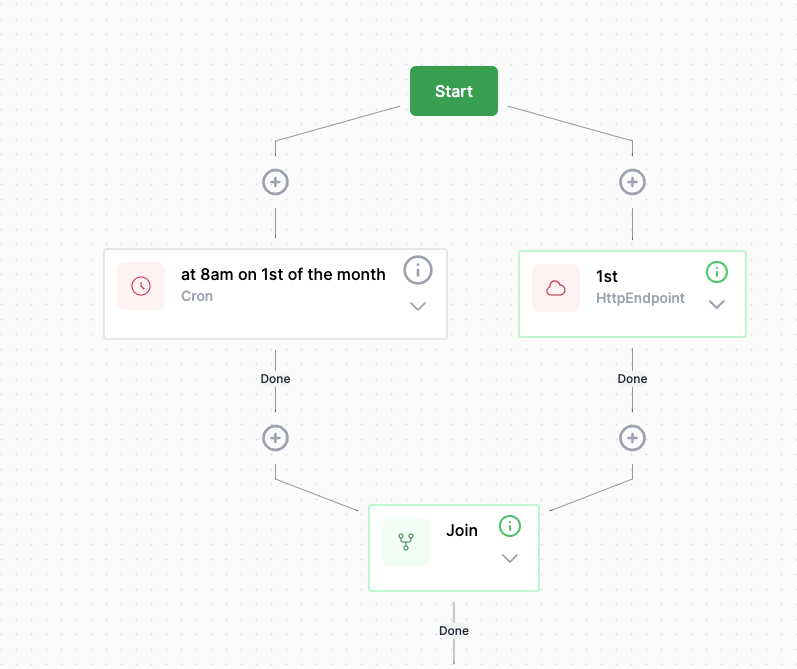

# Dual Triggers

During the development of a workflow, it is common to have a workflow based on a timer that you want to run to test it. The following procedure achieves this:

1. From the Start button, Create the Cron activity as normal.  eg to run on a specific date & time.
2. Add a join task, wait any
3. Again from the start button, add an HttpEndpoint activity, giving it a suitable url (eg '/1st')
4. Link the tasks like this:
   

The workflow will now run either at the specified time, or upon pointing a browser at <host>/<endpoint>. eg https://localhost:7063/1st