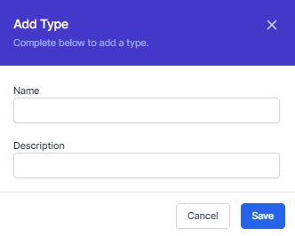

# The Database

Welcome to this module on the World of Workflows database. In this course, you'll learn the basics of World of Workflows database design and management. 

The World of Workflows database is a relational database which is a collection of data organized in tables with columns and rows, allowing for easy access and manipulation of the data. You'll learn about the different types of data types, the rules of good database design, and how to use the user interface and workflows to interact with the database. By the end of this course, you'll have a solid foundation in the principles of world of workflows databases and be able to use them effectively in your work. Let's get started.

To access the database configuration you need to be an administrator or be running the personal edition. If you can see the **admin** tab in the menu, you're good to go.

You access the database by clicking **types** from the Admin Page.

Unless you have already created some types or installed a **Solution**, there will be no types in your system

You can create a new Type by clicking the **Add Type** button

A type is like a table of data which includes **rows** and **columns**, just like a spreadsheet.

The first thing you need to do is give your type a name. This is the name that will be used to refer to the type in the system. You can add a description to remind you (and others) what this type is all about. Click **Save** to save your type.

The example we will work through in this course is to create a simple CRM or Customer Relationsip Management system.

To do this, we will need to create four types;

- Customer
- Contact
- Lead
- Opportunity

Go ahead and create these types.

We've now and hopefully successfully added four types of data. Next we need to add columns to describe the data.

Each type has a column created for you, called Title. This is what we call the title field and is used when linking tables together. For a customer, this should be the name of the company. For a contact it could be the first and last name. You are free to choose what goes in the title field and can also automatically change it later.

Follow along the next section and add the columns we need to get started with our CRM.

To add a column, go back to Types and click **properties** on the type you wish to add a column to.

To add a column to this type, click **Add column** and enter the data as follows:

- The Column Name is the internal name of the column. It's a good idea to make this meaningful and have no spaces. You can use underscores or hyphens to separate words.
- The Display Name is used to show to the user in lists and forms. This can be any text and needs to be meaningful to your users.
- The Column Description is a description you can use to understand the column in the future so you know what it was for.
- The Data Type is the type of data that will be stored in this column. You can choose from a number of different types. We'll cover these in the next section.
- Visible chooses whether the column is visible or invisible to the end user. Invisible columns can be used by workflows to store data but are not shown to the user.
- Indexed means that the column will be indexed for faster searching. This is useful for columns that are used to search for data.

This next section takes about five minutes and over the next five minutes, you're going to setup all the data needed for a See Are Emm environment to manage your sales team.

World of Workflows can store all sorts of data and solve any number of business problems, but in this course we focus on managing your customers and leads.

Clicking Properties on a type allows you to add columns. You add a column by clicking the  Add Column button.

To Customers we are going to add an address which is street address, city, state and postalcode.

We'll then add the website of the customer. Notice we make this a You Are Ell datatype instead of a string. Once done. Customers are complete.

The fields for Customers are shown below:

| Name | DataType | Display Name | Description | Order | Visible |
| -- | -- | -- | -- | -- | -- |
| StreetAddress| String | Street Address | The street address of the customer | 1 | True |
| City | String | City | The city of the customer | 2 | True |
| State | String | State | The state of the customer | 3 | True |
| PostalCode | String | Postal Code | The postal code of the customer | 4 | True |
| Website | URL | Website | The website of the customer | 5 | True |

Next we setup Contacts. Contacts are people who work for a customer, and are the one's we contact directly. 

Let's navigate back to types and then click Properties on Contacts. Feel free to use the top menu if you get it wrong. 

In this case we'll add firstname and LastName as strings.

Next we'll add the contact's email address and phone number. 

If we want to send them a birthday card, lets add their date of birth. <break time="8s"/> 
Finally, lets add a link or relationship to a company so we can see where each user works. Notice I do this by making the data type a big Integer, clicking Foreign Key and choosing the type this is related to.

Here are the fields for Contacts:
| Name | DataType | Display Name | Description | Order | Visible |
| -- | -- | -- | -- | -- | -- |
| FirstName | String | First Name | The first name of the contact | 1 | True |
| LastName | String | Last Name | The last name of the contact | 2 | True |
| Email | Email | Email | The email address of the contact | 3 | True |
| Phone | Phone | Phone | The phone number of the contact | 4 | True |
| BirthDate | Date | Birth Date | The birth date of the contact | 5 | True |
| Company | BigInteger - Foreign Key - Company | Company | The company the contact works for | 6 | True |

Next, we're going to add columns to the Leads type. Leads are special in that they are not going to be related to customers or contacts unless we qualify them, so we seem like we are duplicating some columns.

Leads have the CompanyName, the FirstName and LastName of the contact along with their phone and email address and finally a location for notes.

We expect our sales team will update a lead until qualified then create Customer, Contact and Opportunity Records. We'll use workflows to do this automatically later on, but for now, we're just creating enough columns to work with our data as we need it for our simple solution.

Here are the columns for Leads:

| Name | DataType | Display Name | Description | Order | Visible |
| -- | -- | -- | -- | -- | -- |
| CompanyName | String | Company Name | The name of the company | 1 | True |
| FirstName | String | First Name | The first name of the contact | 2 | True |
| LastName | String | Last Name | The last name of the contact | 3 | True |
| Phone | Phone | Phone | The phone number of the contact | 4 | True |
| Email | Email | Email | The email address of the contact | 5 | True |
| Notes | String | Notes | Notes about the lead | 6 | True |
| Qualified | True/False | Qualified | Whether the lead has been qualified | 7 | True |

Finally, lets add columns to Opportunities. We'll add links to the Company, Contact, and Original Lead first.

Next, lets add a deal value using the Decimal 2 type for money.

Let's add a Close Date using the DateTime type

Finally we'll add some true/false items to represent whether we won or whether the deal is closed or open.

Here are the columns for Opportunity:

| Name | DataType | Display Name | Description | Order | Visible |
| -- | -- | -- | -- | -- | -- |
| Company | BigInteger - Foreign Key - Company | Company | The company the contact works for | 1 | True |
| Contact | BigInteger - Foreign Key - Contact | Contact | The contact for the opportunity | 2 | True |
| OriginalLead | BigInteger - Foreign Key - Lead | Original Lead | The original lead for the opportunity | 3 | True |
| Value | Decimal 2 | Value | The value of the opportunity | 4 | True |
| CloseDate | DateTime | Close Date | The date the opportunity closes | 5 | True |
| Won | True/False | Won | Whether the opportunity was won | 6 | True |
| Closed | True/False | Closed | Whether the opportunity is closed | 7 | True |

So, you can see how easy it is to represent all types of data in the database of types in world of workflows. In the next module we'll look at actually working with data in the user interface and the module after that will deal with views and showing this data to users in a meaningful way.

Previous [Introduction](introduction-module.md) | Next [Views](views.md)