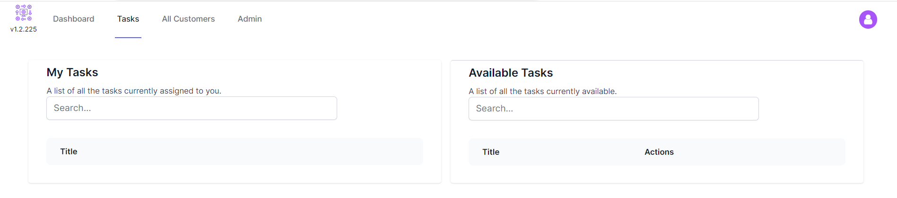
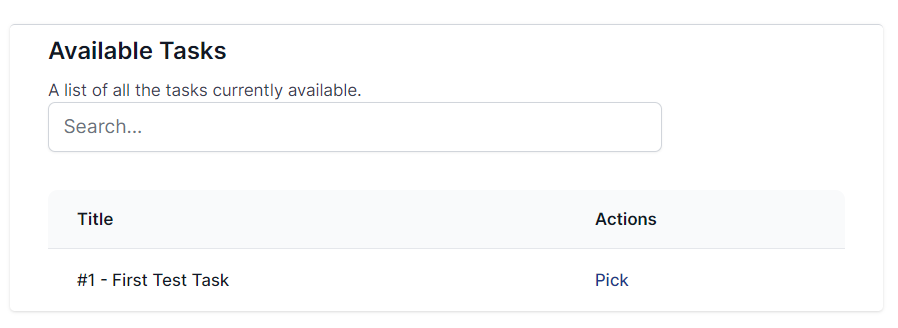
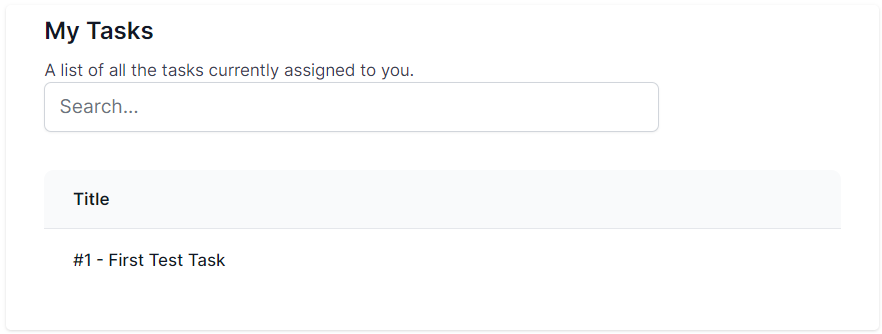
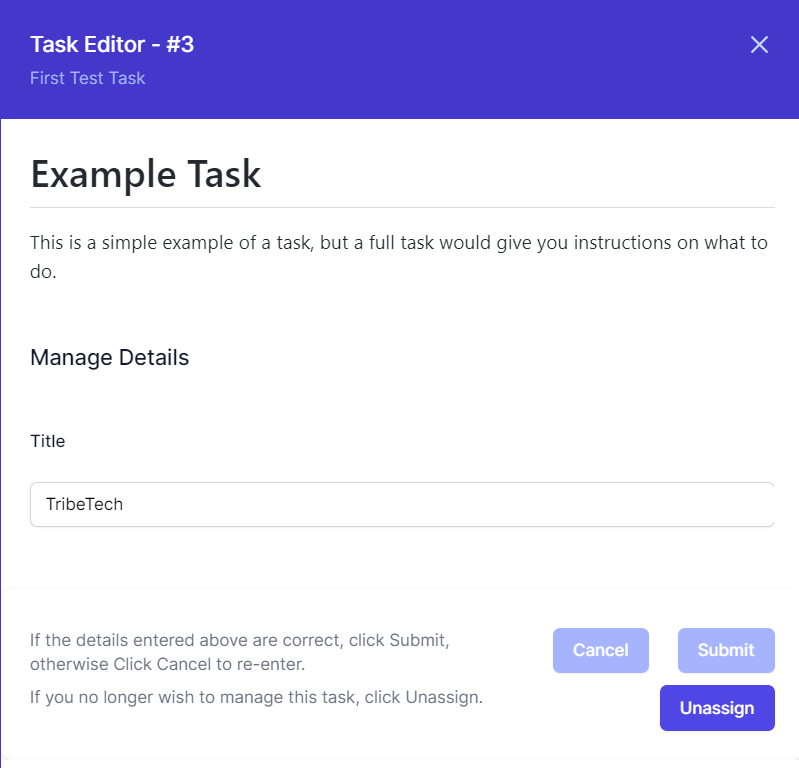
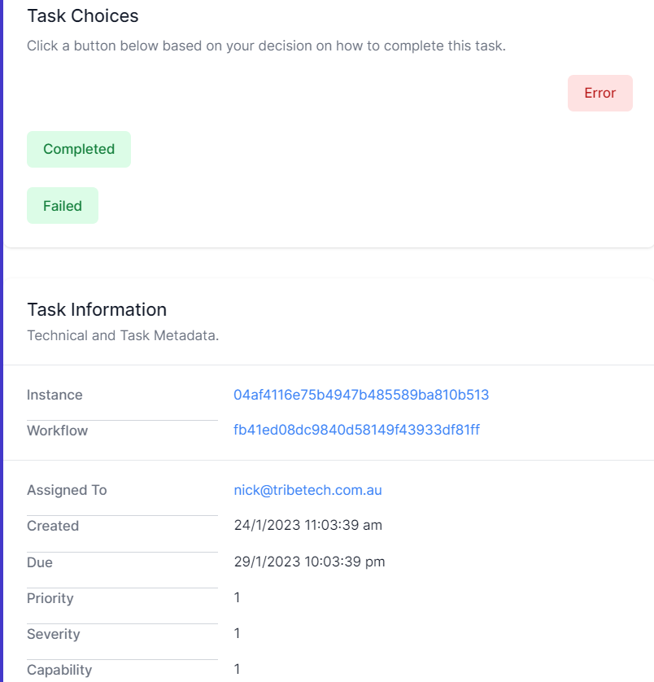

# Tasks

*Click to watch the video*

Welcome to the module on the World of Workflows task management system. This system is designed to help you manage your tasks more effectively and efficiently. With our system, you can create tasks with multiple outcomes, detailed descriptions, and the ability to update data directly from the task itself. 

You'll learn how to set up and configure the system, create and manage tasks, and use its powerful features to stay organized and on top of your work. 

By the end of this module, you'll be able to use the system to its full potential and achieve better results in your work. Let's get started.

Tasks are created using [Workflows](workflows.md) based on all sorts of criteria. In this exercise, we are going to work with some simple tasks, but in the next modules, you'll learn how to use workflows to their full advantage.

## Using Tasks

*The Task Page*

The Task Page is broken into two columns. The column on the left shows tasks that are assigned to you to complete and the right-hand column shows tasks that are available for you to **pick**.

> **Picking** a task takes it from being *unassigned* to *assigned* to you. Tasks assigned to you are invisible to other users and need to be completed, or unassigned so another user can complete the task.

Tasks are available based on the *capability* of the person looking at tasks. This allows you to choose who will see tasks.

### Available Tasks

In the screenshot above, you can see a single available task in the list. You can search for tasks by entering into the Search bar.

To **Pick** a task, simply click on the task you wish to pick.

### My Tasks

Once you have picked a task, it appears in the My Tasks pane. You can search using the search bar. To interact with a task, simply click on it.

## Task Editor

The Task editor is where you can view and update the details of a task. The editor is broken into two sections. The top section shows the task details and the bottom section shows the task metadata.

The top of the task editor shows you the **Task Id**, a unique number for the task, and the **Task Title**, a simple description of the task itself.

Next comes the **Description**, a formatted description that can include data, instructions, images, and more to assist you in completing the task.

Next comes input boxes for any data the author of the task wants you to complete. Completing these fields updates the database.

When you have finished entering data, you can click **Cancel** to revert the data back to its original state or **Submit** to update the database with your new entries.

You can also click **Unassign** if you no longer wish to work with this task. Clicking **Unassign** removes it from your list and adds it to the general queue.

Scrolling down gives the **Task Choices**, a set of ways to complete a task. If you are unable to complete the task, you can click **Error**. However, if you can complete the task, click one of the available choices, in green.

Finally, you get the **Task Metadata** which shows the Workflow and instance that created the task, the Created Date and Due Date, and the Priority and Severity. At the bottom, you can see the capability that this task is assigned to.

> **Note**: if you are using the Personal Edition, Capability and Assigned To are not used.

Previous [Views](views.md) | Next [Workflows](workflows.md)
  
