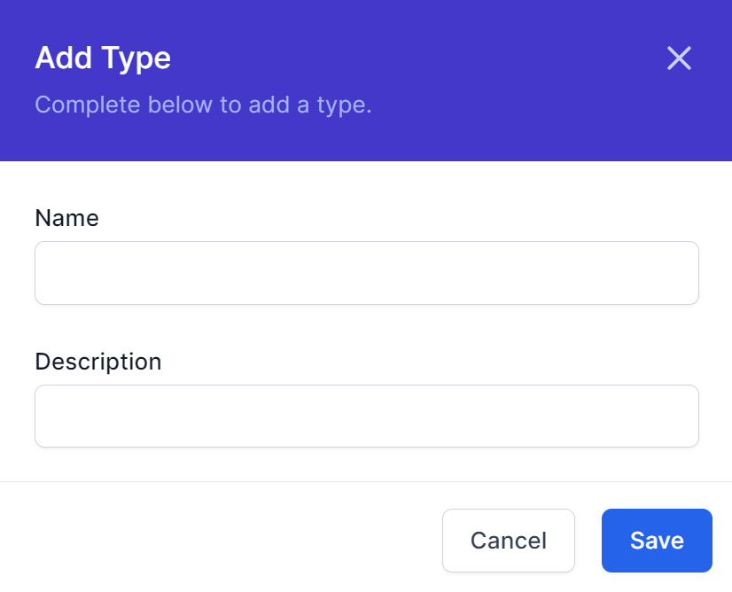

# Object Workflows

This guide shows how to create a workflow that can be executed from within the Object Editor Screen.

The process is as follows
1. Create a Data Type
2. Create an Instance
3. Create a Workflow with a specific name
4. Execute and test the workflow.

The instructions below show how to do this:

## 1. Create a Data Type
1. Go To Workflows
2. Login
3. Navigate to Admin -> Data
4. Click **Add Type**
5. Type the Name and Description and click **Save**
   
6. The example below shows the new type. Make note of the Title of your Type, in my case ```MyNewType```
   

## 2. Creaste an Instance
1. Click the Title of the Type you created above
2. Click **Add**
3. Enter the attributes of the new instance (in my case, this is just the title) and click **Save**
   
4. The example below shows the new instance.
   

## 3. Create a Workflow with a specific name
1. Navigate to Workflows - Workflow Definitions
2. Click **Create Workflow**
3. Click the Cog and enter details as follows:
   1. Name is ```TypeName_Workflowname``` where the type name was chosen in step 1 above, in our case ```MyNewType``` Therefore our Name would be ```MyNewType_FirstWorkflow```
   2. DisplayName is what you want to appear in the user interface. In our case I will use ```First Workflow for Testing```
       
    3. Click **Save**
4. Click **Start** and add the Activity **Object Detail to Variable** from the **Data** Section
   1. On Object Id, click the ... button and Choose ```JavaScript```. In the box, type ```input```
   2. On State choose ```C``` for current state
   3. On VariableName type ```ChosenObject```
      
   4. Click **Save**
5. Click **Publish**

## 4. Execute and Test Workflow
1. Navigate to Admin -> Data
2. Click the Name of the New Type created in Step 1
3. Click Edit in the FirstInstance
4. Click Workflows
   
5. Click the 3 Vertical dots
6. Navigate to Workflows -> Workflow Instances
7. Choose the top instance
8. Click the Object Detail to Variable Activity
   
9. Click **Variables**
    
10. Ensure the variable shows the object you chose

> Congratulations, you have created a workflow that can be executed from within the Object Editor Screen.