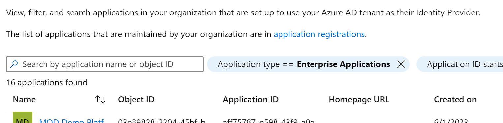

Welcome to World of Workflows! World of Workflows is a software solution that allows anyone to automate business processes, be those simple processes for yourself or processes which encompass your entire business. 

## Overview of World of Workflows

World of Workflows is a powerful software solution designed to streamline and optimize your business processes by providing an intuitive platform for creating, managing, and automating both simple and complex workflows. We consider any process you perform with more than one step to be considered a workflow. With over 100 activities to choose from, and plugins which extend this functionality, you can easily tailor workflows to suit your organization's specific needs. By integrating a rich, dynamic, user-configurable database and an advanced task management system, World of Workflows enables you to efficiently manage your projects and tasks, collaborate with your team, and track progress in real-time.

World of Workflows comes in two key editions:

- **Personal Edition** or PE runs on your local PC and is for personal use or workflow development.
- **Business Edition** or BE runs on any of the major cloud providers or your servers and offers enhanced features such as single sign on and rich permissions and access control.

## Key features and components of World of Workflows

- Workflow Editor, a core component of World of Workflows, offers a flexible and user-friendly interface for building and customizing workflows. Some of the key features and components include:
  - A wide range of pre-built activities that can be easily added, edited, and connected within your workflows.  These activities can be extended using Plugins.
- A user-configurable database for managing data and integrating with external databases or APIs.
- A robust task management system that enables you to create, assign, and track tasks, as well as collaborate with your team members.
- Workflow templates called Solutions for quickly implementing common processes and best practices.
- Advanced features such as workflow automation with triggers, third-party application integration, and the ability to create custom activities.
- Comprehensive security and permissions settings to ensure data protection and controlled access *with business edition*.
- Plugins, which extend the capability of the system.
- OData access which simplifies the process of reporting and dashboarding of your data.
- Credential manager which allows you to securely connect to 3<sup>rd</sup> party APIs and systems, such as ChatGPT, Xero, Office 365 and many, many more.

Our extensible database which can be accessed from the User Interface or within workflows provides the following features:

- Extremely high performance
- Customizable tables (Types), Columns and Relationships
- Custom views to see filtered and sorted database entries.
- Flexible import
- Full Export
- Inline editing
- Sort, Filter and paging

Our detailed task system allows for the system to reach out to users and instruct them where manual tasks are required and includes the following features:

- Task Queues
- Task Details formatted with Markdown
- Update data in the database directly from a task
- Custom outcomes which branch the workflow.

## Examples of process automation with world of workflows.

Our customers have used world of workflows to automate a number of business processes. Here are some examples:

1.  A media company uses world of workflows integrated with ChatGPT to write draft articles on incoming press releases automatically.
2.  A soccer club uses world of workflows to notify coaches and managers when it is their turn to put up or take down nets on a soccer field based on the draw in an external system.
3.  An independent school uses world of workflows to manage their enrolment process.
4.  A managed service provider users world of workflows to correctly bill customers for their telephone voice usage.
5.  A sporting club uses world of workflows to automatically generate a weekly newsletter.
6.  A not-for-profit uses world of workflows to manage their grants application process.

# Getting Started

This chapter will guide you through the initial steps of setting up and using World of Workflows, including system requirements, installation, account creation, and navigation of the user interface. By the end of this chapter, you will be well-prepared to begin exploring the software's features and functionalities.

## System requirements

Before installing World of Workflows, ensure that your system meets the following minimum requirements:


| Requirement | Personal Edition | Business Edition |
| -- | -- | -- |
| Operating System | Windows 10 or better| Windows 10 1607+, macOS 10.15 (Catalina) or later, or Linux (Ubuntu 18.04 or later). Includes Windows Server 2012 and above. |
</tr>
<tr class="even">
<td>Processor</td>
<td>Intel Core i3 or equivalent</td>
<td><p>Intel Core i3</p>
<p>ARM processor</p>
<p>Apple M1, M2</p></td>
</tr>
<tr class="odd">
<td>Memory</td>
<td>4Gb RAM Recommended</td>
<td>8Gb RAM Recommended</td>
</tr>
<tr class="even">
<td>Disk Space</td>
<td>512Mb Available Storage</td>
<td>2Gb Available Storage</td>
</tr>
<tr class="odd">
<td>Internet Connection</td>
<td>Broadband Connection</td>
<td>Broadband Connection</td>
</tr>
<tr class="even">
<td>Database</td>
<td>Included</td>
<td>Included or Microsoft SQL Server (Optional)</td>
</tr>
</tbody>
</table>

*Please note that better performance may be achieved with higher system specifications.*

## Installation process

### Installing World of Workflows PE

To install World of Workflows PE for Windows, follow the steps below:

1.  Visit the World of Workflows website (www.worldofworkflows.com) and navigate to the Plans and Pricing section.
2.  Choose the appropriate plan and then download the appropriate installer for your operating system (Windows, macOS, or Linux).
3.  Download the installer and save it to your desired location.
4.  Run the installer and follow the on-screen prompts to complete the installation process.
5.  Once the installation is complete, launch World of Workflows using the desktop shortcut or by searching for it in your applications menu.

### Installing World of Workflows Business

As World of Workflows Business works with Azure Active Directory, the process for installation is a little more complex and requires additional work.

#### Pre-requisites

In order to install world of workflows BE, you will need:

1.  Access to an Azure Active Directory Account and have the “Manage Applications” permission.
2.  Access to the Microsoft Azure Portal and have access to application registrations and enterprise applications
3.  Access to a server to run World of Workflows. This can be Windows, Linux or Mac, will need to have a SSL certificate and be available on the web on port 443 for SSL.

#### Installation Process

1.  Download World of Workflows BE
    1.  Once you have subscribed to World of Workflows BE, you will be granted access to the installation resources. Download your copy of World of Workflows BE for the platform you are installing to. The download will come as a zip file.

2.  Prepare Azure Active Directory
    1.  The process to install World of Workflows BE is complicated, but has been simplified for you through a simple powershell script.
    2.  Inside the zip file downloaded in section 1, above, you will find the file WOWFBEConfiguration.PS1
    3.  From a powershell prompt, run as Administrator, run WOWFBEConfiguration.PS1
    4.  The script will launch a browser for you to login as the admin account from the pre-requisites
    5.    
        the script will as for the name of the Client and Server Applications. These are for their registrations in Azure AD. Press Enter to accept the defaults or Enter your own entries. **Note:** The system creates two application registrations, one for the Client application and another for the server.
    6.    
        Next, enter the address of your instance in the format as shown. This will be the final URL of your World of Workflows Installation.
    7.    
        When complete, the powershell script will return you to the login prompt.
    8.  Navigate to App Registrations in the Azure Portal (<https://portal.azure.com>) -\> Azure Active Directory -\> App Registrations
    9.  Choose your Server Application named in step g above
    10. Click **API Permissions**
    11. Click **Add a permission**
    12.   
        Click **Microsoft Graph**
    13. Choose **Delegated Permissions**
    14. Search for **User.Read.All**
    15. Select the checkbox and click Add Permissions  
        
    16. Click **Grant Admin Consent**
    17. Navigate to **Azure Active Directory -\> Enterprise Applications**
    18. Click the **X** on the filter saying Application type == Enterprise Applications X  
        
    19. Select your Server Application
    20. Click Users and Groups
    21. Grant the users who will administer World of Workflows Administrative Access

## Installation of Business Edition

### Installation on a Windows Server using IIS

This is the procedure to install on a Windows Server using IIS

1.  Create a new folder for World of Workflows
2.  Extract the contents of the downloaded Zip File
3.  Copy the appsettings.json file created above to that folder
4.  In IIS, create a new WebSite, and point it at the folder
5.  Download and install the ASP.NET Core Runtime Hosting bundle from https://dotnet.microsoft.com/en-us/download/dotnet/7.0

### Installation on an Azure Web Application

The process for installation on an Azure Web Application.

1.  Create a New Azure Web Application
2.  Create a zip file with the root being the platform level (.e.g linux-x64)
3.  Copy appsettings.json configured above to the zip file
4.  In powershell, run the following commands:

```powershell
connect-AzAccount \#Connect to Azure  
get-AzSubscription \#Show Azure Subscriptions  
set-azContext -Subscription \<SubscriptionID\> \#Connect to the correct subscription  
publish-AzWebApp -ResourceGroupName \<ResourceGroup\> -Name \<AppName\> -ArchivePath \<Path_to_Zip_File\> \#publish the application
```

### Navigating the user interface

The World of Workflows user interface is designed to be intuitive and user-friendly. Here are the main components to familiarize yourself with:

- **<span class="smallcaps">Dashboard:</span>** The Dashboard provides a high-level overview of your projects, tasks, and workflows. From here, you can access the Task Management System, User Configurable Database, and Workflows editor.
- **<span class="smallcaps">Tasks:</span>** This section allows you to create, assign, and manage tasks, as well as collaborate with your team.
- **<span class="smallcaps">Views:</span>** Views you have created will show as menu options, beside Tasks
- **<span class="smallcaps">Admin</span>**: Accessible through the admin section in the top-right corner, this section allows you to manage
  - **<span class="smallcaps">Workflows</span>**: This is where you can create, edit, and manage your workflows, add and configure activities, and automate processes using triggers.
  - **<span class="smallcaps">Types</span>**: Here you can create, modify, and manage your data tables, export data, and integrate with external databases or APIs.
  - **<span class="smallcaps">Views</span>**: You can create, modify and manage collections of data types, called Views.
  - **<span class="smallcaps">Tasks</span>**: You can view and manage all of the tasks in the system.
  - **<span class="smallcaps">Import</span>**: Our intuitive import wizard allows you to import CSV data into the platform
  - **<span class="smallcaps">Workflows University</span>**: Integrated training and solution content to help you get the most out of the platform
  - **<span class="smallcaps">Documentor</span>**: Instantly create automatic documentation of your configuration including database and workflows.
  - **<span class="smallcaps">Settings</span>**: your account settings, security, and permissions.
  - **<span class="smallcaps">Plugins</span>**: Extend your system with plugins from our plugin library
  - **<span class="smallcaps">Solutions</span>**: Import and export entire configurations to allow rapid prototyping and deployment.

With your World of Workflows account set up and a basic understanding of the user interface, you are now ready to dive into the powerful features and functionalities of the software. The following chapters will provide in-depth guidance on using the User Configurable Database, Task Management System, and Workflows to optimize your business processes.
