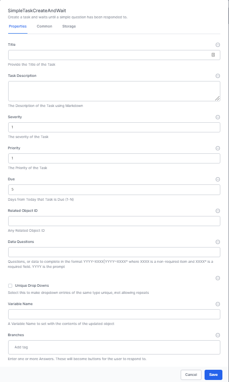
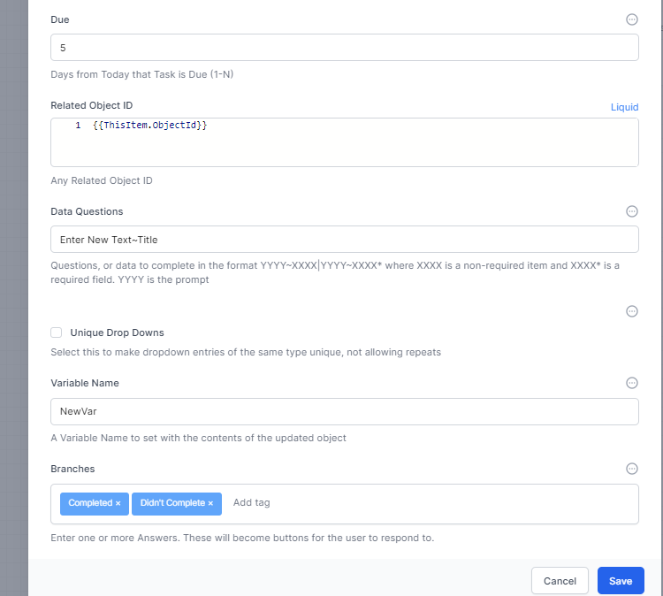

# Working with Tasks

One of the most common activities in a workflow is to perform a task. A task is an activity that requires a user to perform some action. For example, a task could be to review a document, approve a purchase order, or to enter a customer's credit card information. A task can be assigned to a user or a group of users. A task can also be assigned to a user based on a capability. For example, a task could be assigned to a user with the capability of "Approve Purchase Orders".

Tasks allow you to display diagrams, instructions, receieve data from the end user and create custom buttons for the user to press which you can use to control the flow of the workflow.

## Creating a Task
There are three ways to create a task in World of Workflows anbd tach of these are under the tasks activities.

These are:

- **Simple Task Create and Wait** - The most flexible option, this creates a Task and then waits for the user to respond to it.
- **Task Create and Wait** - More limited and simpler than Simple Task Create and Wait, this creates a task and waits for the user to respond to it.
- **Task Create** - This creates a task and continues with the workflow.

In this document we will focus on **Simple Task Create and Wait**.

Once you have added your **Simple Task Create and Wait** activity, Right Click and Choose Edit.



Enter the information as shown below:

1. **Title** - This is the title of the task and is used for end users to get an idea of what the task entails. This can be created using plain text, [Liquid](../liquid/README.md) or [Javascript](../javascript/README.md).
2. **Task Description** - The Task Description is written in [Markdown](../markdown-cheat-sheet.md) and also supports [MermaidJS Diagrams](../mermaid-cheat-sheet.md). The text for this can be created using plain text, [Liquid](../liquid/README.md) or [Javascript](../javascript/README.md). Use the description to provide detailed instructions for your end users on how to complete the task. We recommend having all the data here for the user to complete the task without referring to other systems.
3. **Severity** - This is a number from 1 to 3 which describes the severity of the task. The higer the severity, the nearer the top of task lists this task appears. This can be created using plain text, [Liquid](../liquid/README.md) or [Javascript](../javascript/README.md).
4. **Priority** - This is a number from 1 to 3 which describes the priority of the task. The higer the priority, the nearer the top of task lists this task appears. his can be created using plain text, [Liquid](../liquid/README.md) or [Javascript](../javascript/README.md).
5. **Due** - This is the number of days before the task times out. On time out, the workflow will stop waiting and will proceed down the timeout branch. his can be created using plain text, [Liquid](../liquid/README.md) or [Javascript](../javascript/README.md).
6. **Related Object Id** - If you wish the user to update an object in the database as part of the task, then you will need to set the related Object id. This can be set from the ```input``` variable when starting a workflow from the UI or from some other method. his can be created using plain text, [Liquid](../liquid/README.md) or [Javascript](../javascript/README.md).
7. **Data Questions** - These are set by the syntax ```XXXX~YYYY``` *Note no spaces*. This defines the fields from the type (from the Related Object Id above) that you wish the user to complete as a part of the workflow. These input boxes appear directly below the description of a task.
8. **Unique Drop Downs** - Not available in this version.
9. **Variable Name** - When entered, the results of the modified Related Object will be placed into this workflow variable which will create a new variable if one doesn't already exist. This can be used to update the object in the database. his can be created using plain text, [Liquid](../liquid/README.md) or [Javascript](../javascript/README.md).
10. **Branches** - These are entered as tags, and you can press **Enter** and add as many tags as you want. These present the user with buttons they can click which direct the workflow down a specific path. This can be created using plain text, [Liquid](../liquid/README.md) or [Javascript](../javascript/README.md).

See the example below for a completed task definition



This example gives the following result to the end user:


